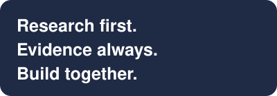

# Koushik Das

Independent researcher and systems architect. Built in India, for the world.

My work asks one question at every layer of a medical system: can this result
be trusted, and does the system know when it can't?

<table>
<tr>
<td width="62%" valign="top">

### About

#### One research programme, built one validated step at a time

I'm Koushik Das, an independent researcher. Across the work presented here, I serve as the architect and algorithm designer: I define what each system should do, how it should behave when the evidence is limited, and how its performance should be evaluated. Implementation is carried out by my team together with AI coding agents, working from these designs, and every change is reviewed and tested before release.

Although my projects may appear separate, each is a component of a larger, long-term research programme. Each one examines a single idea carefully before it becomes part of that wider effort: whether a system can decline to answer rather than guess, whether evidence can remain traceable from its source to the final decision, and whether a benchmark can be fixed in advance and still be met. Testing these ideas early, openly and on a small scale gives the larger programme a stronger foundation.

Further work in my archive will be shared over time, including research on protein mutation, biological computation, and a haematology report analysis system for clinical decision support, which is currently in its clinical validation and refinement phase.

The next stage of this work will benefit greatly from a wider team. Two colleagues currently contribute to testing and architecture review, and I would warmly welcome more: researchers from universities and medical colleges, clinicians, reviewers and constructive critics. The collective's charter describes how we work together, how ownership and intellectual property are protected, and how every contribution is publicly recognised.

If you lead a startup or research group and feel I could contribute, I would be glad to hear from you by email. I work best with clear goals and the autonomy to pursue them, and I am always happy to discuss my work through the projects and evidence presented here.

</td>
<td width="38%" valign="top">

**[Whitepaper](https://nabvian.github.io/whitepaper/)** 
The Evidence-First Research Collective: a charter for shared work, clear ownership and public recognition

**[Preprint](https://doi.org/10.5281/zenodo.23097652)** 
Adding Capabilities Without Silent Regression: A Frozen Core, Capability Routing, and Conservative Promotion (Zenodo, 2026)

**[Live projects](https://nabvian.github.io/)** 
nabvian.github.io: live demos and research showcases

**[Email](mailto:engikd1993@gmail.com)** 
engikd1993@gmail.com

</td>
</tr>
</table>

## The layers

**Knowledge.** Domain-blind reasoning engines for pathology, radiology,
oncology and rare disease. The engine knows nothing about medicine; the
medicine lives in knowledge a clinician can read, check and correct. Nothing is
guessed: every threshold and code traces to a source, and missing evidence is
reported as missing.
Public: [orphara-engine](https://github.com/nabvian/orphara-engine),
[caretrace-core](https://github.com/nabvian/caretrace-core)

**Learning (EG).** Rules alone don't read a blood smear or an X-ray; learned
models do, and a model can be confidently wrong on data from a hospital it has
never seen, with no internal warning. EG, evidence-gated networks, lets
evidence flow only when it is valid for the path it takes, and carries
reliability separately from prediction so that failure shows up instead of
hiding. It is a research hypothesis with a preregistered test that can reject it.

**Application (DMOS).** Where EG meets real data: structural findings from
blood smears. Private until clinically validated, because opening an
unvalidated medical tool is a risk, not a contribution.
Repository: [dmos-blood-smear](https://github.com/nabvian/dmos-blood-smear)
(private; access for reviewers and collaborators on request)

**Growth (UMNA).** A system that covers more medicine keeps gaining
capabilities, and each addition must not silently change what already worked.
UMNA keeps a frozen core, adds capabilities as versioned modules, routes
between them under hard budgets, and abstains when it isn't sure. Working
prototype; its hypotheses are not yet independently established.
Public: [umna-benchmarks](https://github.com/nabvian/umna-benchmarks)

**Computation (Q-BenchMed, BioCompute).** Before a new kind of computer is
trusted with a medical decision, it should be measured. Q-BenchMed gives
quantum optimisation and classical solvers the identical biomarker-selection
problem and reports what happens, including where quantum loses. Its latest
result: a constrained quantum ansatz beat a random valid answer on every
instance tested, where standard QAOA almost always lost to one. BioCompute goes
further out: computing inside molecules, compiling programs into chemical
reaction networks and checking the answers read back from noisy measurements
against an independent reference. Q-BenchMed runs in simulation; BioCompute is
at model-level proof of concept.
Public: [qbenchmed](https://github.com/nabvian/qbenchmed)

## Currently

- Taking Q-BenchMed's constrained-mixer experiment from simulation onto real
  quantum hardware, where two-qubit noise will decide whether its advantage
  survives.
- Moving UMNA from prototype to preregistered validation on real models.
- Extending the rare-disease engine's knowledge across haematology.

## How we work

I design the architecture and lead the research. My team, together with my AI
coding agents, writes and tests the code, so the person who designs a system is
never the only one certifying it.

Results are published as they come out, including the negative ones and my own
mistakes. Each project states its stage plainly: specification, prototype, or
validated. Engines are open source under AGPL; clinical components open after
validation.

## Collaboration

I'm looking to work with:

- clinicians and pathologists willing to review medical knowledge before it is
  used;
- hospitals and laboratories with data from sites a model has never seen, which
  is the test EG exists to pass;
- researchers with access to quantum hardware;
- funders who back open, independently checkable work.

How contributors work together, own their work and are credited is set out in
the [collective's charter](https://nabvian.github.io/whitepaper/).
